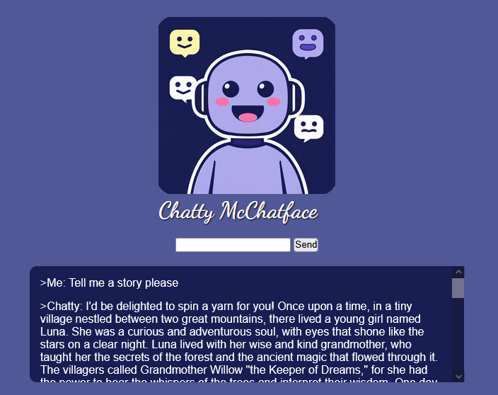

# Chatty McChatface - Basic setup for a browser accessible chat companion with langchain and fastapi.

A simple conversational chatbot based on the [llama3](https://ollama.com/library/llama3) model. The interface is accessible through a webpage which uses websockets to communicate chat requests and responses.

## Instructions

1. Install the [ollama application](https://ollama.com/download).
2. Download the model through the ollama cli: `ollama pull llama3`. (the model save localtion can be modified through the ollama system tray icon).
3. Prepare the environment (see the provided [`requirements.txt`](./requirements.txt) or [`Pipfile`](./Pipfile)).
4. Start the application with `fastapi run chatty-mc-chatface.py`.
5. Navigate to the default endpoint `http://0.0.0.0:8000`.

## Possible expansions:

- Restore message history in frontend on page reload.
- Add multiple sessions based on ID.
- Buttons for deleting history, starting new chat session.
- Database for history persistence after restarting server.

### Sources
- Image logo created with: [deepai.org](https://deepai.org/)
- [FastAPI documentation](https://fastapi.tiangolo.com/)
- [LangChain documentation](https://python.langchain.com/docs/introduction/)
- [YouTube - LangChain chat memory](https://www.youtube.com/watch?v=v-dO88wU-jM)
- [Google Fonts - Dancing Script](https://fonts.google.com/specimen/Dancing+Script)